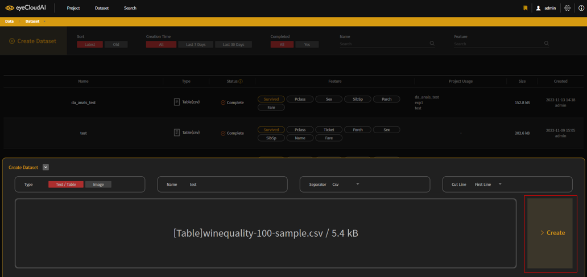
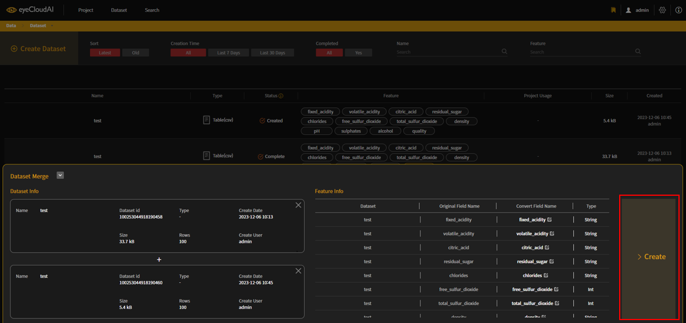
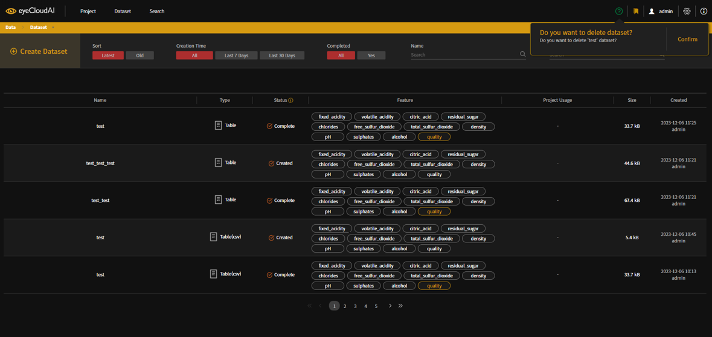
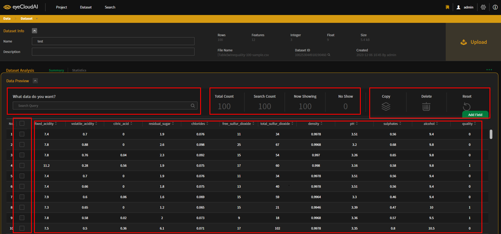

# AutoAPE User Guide - Dataset

- ### Dataset Tab Function
  + 생성 : Create
  + 분석 : Summary, Statistics, EDA Result
  + 관리 : Management, Edit
  + 서버 업로드 : Upload
  

| Action | Description |
| ---- | ----------- |
| [**Dataset Tab**](#datasettab) | 데이터셋 탭 |
| [**Create**](#create) | 데이터셋 생성 |
| [**Management**](#management) | 데이터셋 관리 |
| [**Summary**](#summary) | 데이터셋 분석 요약 |
| [**Statistics**](#statistics) | 데이터셋 통계 정보 |
| [**Edit**](#edit) | 데이터셋 내 데이터 수정 |
| [**Upload**](#upload) | 데이터셋 업로드 |
| [**EDA Result**](#edaresult) | 데이터셋 EDA 결과 정보 |

## <a id="datasettab"/> **Dataset Tab**

- Dataset Tab 을 클릭하여 접속한다.
- 상단의 표시된 영역의 좌측부터 생성일시 순 정렬, 생성일자 필터링, 업로드 완료 여부 필터링, Dataset 이름 검색, Dataset 내부 Feature 검색 의 기능을 수행할 수 있다.
## <a id="create"/> **Create**

- 상단의 Create Dataset 버튼을 클릭한다.
   

- 파일 타입을 선택한다.

- Dataset 의 이름을 작성하고 로컬에서 본인이 업로드하고자 하는 Dataset 을 선택한다.

- 우측의 Create 버튼을 클릭하여 Dataset 을 생성한다.
## <a id="management"/> **Management**

- 하나의 Dataset 에 마우스를 올리면 표시된 것과 같이 세가지의 버튼이 생성된다.
    * Merge : 병합
    * Copy : 복사
    * Delete : 삭제

  ### Merge
- Merge 기능은 두 Dataset 을 하나의 Dataset 으로 병합하는 기능이다.

- Merge 버튼을 클릭하면 위 화면을 확인할 수 있고, 위의 표시된 부분에서 Dataset 내의 Field 이름을 설정할 수 있다.

- 병합할 두개의 Dataset 을 모두 선택하고 합쳐질 Field 의 이름을 모두 설정하였다면 우측의 Create 버튼을 클릭하여 병합된 Dataset 을 생성한다.
  
  ### Copy
- Copy 기능은 선택한 Dataset 을 복사하여 생성하는 기능이다.

- Copy 버튼을 클릭하면 위 화면을 확인할 수 있고, 선택한 Dataset 의 Field 이름을 변경하여 생성 가능하다.
  
  ### Delete
- Delete 기능은 특정 Dataset 을 삭제하는 기능이다.

- Delete 버튼을 클릭하면 상단에 확인창이 표시되고, Confirm 버튼을 클릭하면 삭제된다.

## <a id="summary"/> **Summary**

- Dataset 의 분석정보 요약
- 정확한 분석 프로세스는 Upload 과정에서 거치기 때문에 Upload 전에는 로컬에서 간단한 분석만을 수행하여 Upload 전과 후의 정보가 다르다.
  
  ### Before Upload

- 위 화면은 하나의 Dataset 을 선택하면 확인할 수 있는 화면이다.
- 좌측에 표시된 부분은 Dataset 의 분석정보(로컬)를 출력하고 특정 Feature 를 선택할 수 있고, 우측에 표시된 부분은 좌측에서 선택된 Feature 의 차트 정보를 출력한다.

- Feature 의 차트 정보를 확인할 때, 표시된 부분을 통해 차트의 유형을 변경할 수 있다.
  
  ### After Upload

- Dataset 의 분석정보를 출력하고 특정 Feature 를 선택하여 차트 정보를 확인할 수 있다.
- 표시된 부분의 구성은 Feature 의 타입이나 특성에 따라 달라지고 차트 정보가 없는 Feature 도 존재한다.

- 차트 정보가 존재하지 않는 경우
## <a id="statistics"/> **Statistics**
- Dataset 의 통계정보
   

- 위 화면은 표시된 Statistics 버튼을 클릭하여 확인할 수 있는 화면이다.
- 각 Feature 별로 가지고 있는 값의 비율을 표시한다.

- 표시된 아이콘을 통해 화면에 표시할 Feature 를 설정할 수 있다.

- Feature 내 특정 행을 클릭하면 위와 같이 실제 Dataset 내에서 해당 Feature 의 해당 값에 해당하는 row 들을 검색할 수 있다.
## <a id="edit"/> **Edit**

- Dataset Data 수정 기능 

- Dataset 을 선택하면 하단 부의 Data Preview 부분이 표시되는데, 해당 영역을 클릭하거나, Summary 탭의 차트의 요소 부분을 클릭하면 실제 Dataset 을 확인할 수 있다.

- 기본 상태

- 기본 상태 (이미지 Data) : 우측 하단에 보기 형식을 바꿀 수 있는 버튼이 있다. 위 화면은 썸네일 그룹 상태이다.

- 이미지 Data 보기 형식 : 개별 이미지 

- 개별 이미지 상태일 경우 이미지 위에 마우스를 올리면 해당 이미지의 정보를 확인할 수 있다.
- 해당 정보 영역 상단 부의 아이콘 중 좌측 압정 아이콘은 현재 정보가 표시되는 상태로 고정하는 버튼이고 우측 이미지 아이콘은 해당 이미지의 원본 이미지를 확인할 수 있는 버튼이다.

- 원본이미지 : 좌측 상단의 다운로드 버튼으로 다운로드 받을 수 있고 우측 상단의 x 버튼으로 원래 화면으로 돌아갈 수 있다.

- 이미지 Data 보기 형식 : 한 줄 보기 

- Summary 내 차트 요소 클릭 후 상태 (검색)

- 표 안의 셀을 오른쪽 클릭하여 검색, 복사 등의 기능을 활용 가능하다.

- 위 화면에 표시된 것과 같이 Data Preview 영역의 상단부는 좌측부터 검색, Data 행, 버튼의 3부분으로 구성되어 있다.
    + 검색 : Query 형태로 검색하여 조회 가능하다. ex) pH:"3.51"
    + Data 행 : 좌측부터 Data 의 총 개수, 검색한 조건으로 조회되는 행 개수, 대용량 Data 를 대비해 불러오는 Data 의 양을 제한하여 스크롤 이벤트로 스크롤이 끝에 닿으면 다음 Data 를 불러오기 때문에 현재 불러온 Data 수, 아직 불러오지 않은  Data 수.
    + 버튼 : Upload 이전에만 표시되며 좌측부터 행 복사, 행 삭제, 검색 초기화, (Add Filed : Feature 추가) 기능을 한다.
- 하단부는 체크박스와 Data 표로 구성되어 있다. 이미지 Data 의 경우에는 기본적으로 썸네일 그룹이 표시되며 보기 형식을 변경할 수 있다. Dataset 의 수정은 Upload 이전에만 가능하다.
    + 체크박스 : 체크하여 하나 이상의 행을 선택할 수 있으며, 최상단의 체크박스를 선택하면 전체 선택이 가능하다.
    + Data 표 : 실제 Dataset 의 Data 이며 각 셀의 값을 변경하거나 Feature 의 이름을 변경할 수 있다. 또, 표의 최상단 Feature 의 이름 우측 아이콘을 클릭하여 Data 를 정렬할 수 있다.
  
  ### Copy

- 행 선택 후 Copy 버튼을 클릭하고 상단의 대화창에서 선택한 행을 몇 회 복사하여 생성할 것인지 결정하여 Confirm 버튼을 클릭한다.
  
  ### Delete

- 행 선택 후 Delete 버튼을 클릭하고 상단의 Confirm 버튼을 클릭한다.
  
  ### Edit

- 원하는 셀을 더블클릭한 후 값을 변경하고 상단의 Confirm 버튼을 클릭하여 수정한다.
  
  ### Add Field

- Add Filed 버튼을 클릭하여 새로운 Feature 를 추가한다.
  
  ### Edit Field

- 원하는 Feature 를 더블클릭한 후 값을 변경하여 수정할 수 있고, Delete 버튼을 클릭하여 삭제할 수 있다.

## <a id="upload"/> **Upload**

- Project 생성에 활용하기 위해 서버에 Upload.
- Upload 과정에서 DA(Data Analysis) 와 EDA(Exploratory Data Analysis) 프로세스가 동작한다.

- Target Field 로 지정할 Feature 를 선택한 후 우측 상단의 Upload 버튼을 클릭하여 Upload 한다. 이 때, NON-Target 을 선택하여 비지도 학습을 위해 Target Field 를 지정하지 않을 수 있다.

## <a id="edaresult"/> **EDA Result**

- Table 타입의 Dataset 일 경우 Upload 가 완료되면 EDA Result 탭이 활성화 되며, EDA 결과를 차트로 확인할 수 있다.

