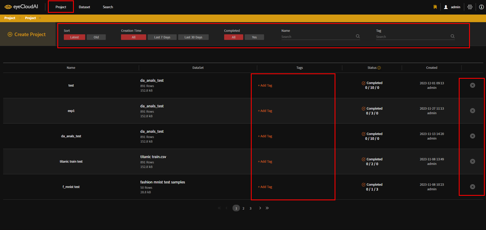

# AutoAPE User Guide - Project

- ### Project Tab Function
    + 생성 : Create
    + 모델 추천 : AutoML
    + 분석 : Dataset, Models, Performance, Comparison
    + 검증 : Validation
    

| Action | Description |
| ---- | ----------- |
| [**Project Tab**](#projecttab) | Project 생성 |
| [**Create**](#create) | Project 생성 |
| [**Dataset**](#dataset) | Project Dataset 정보 |
| [**AutoML**](#automl) | 모델 추천 |
| [**Models**](#models) | 생성된 모델 정보 |
| [**Performance**](#performance) | 모델 성능 확인 |
| [**Comparison**](#comparison) | 모델 성능 비교 |
| [**Validation**](#validation) | 모델 검증 |

## <a id="projecttab"/> **Project Tab**

- Project Tab 을 클릭하여 접속한다.
- 상단의 표시된 영역의 좌측부터 생성일시 순 정렬, 생성일자 필터링, 학습 완료 여부 필터링, Project 이름 검색, Project Tag 검색 의 기능을 수행할 수 있다.
- Tags 컬럼의 표시된 부분의 Add Tag 버튼을 클릭하면 입력창이 표시되고 Tag 로 설정할 텍스트를 입력하여 Tag를 추가할 수 있다.
- 각 Project 의 가장 우측부분 X 아이콘을 클릭하면 해당 Project 를 삭제할 수 있다.
## <a id="create"/> **Create**

- 상단의 Create Project 버튼을 클릭한다.

- Project 의 이름과 설명, 추가할 Tag 를 설정하고 Next 버튼을 클릭한다.

- 이 때, Project 의 이름이 이미 존재한다면 상단에 경고창이 표시된다. 중복되지 않는 이름으로 변경하여 다시 Next 버튼을 클릭하지 않으면 다음 단계로 진행할 수 없다.

- 중복을 피해 Project 의 이름을 설정했다면 학습에 사용할 Dataset 을 선택하는 화면이 표시된다. 본인이 원하는 Dataset 을 선택해 Create 버튼을 클릭하여 Project 를 생성한다.

## <a id="dataset"/> **Dataset**

- Project 생성 시 선택한 Dataset 의 정보를 표시한다. 위 화면은 Table Type Dataset 의 정보이다.
  + Profile : Dataset 내의 raw data 정보
  + Feature List : 로컬에서 분석한 각 Feature 의 분석 정보
  + EDA Result : Table Type Dataset 일 경우에만 표시되며 Image Type 일 경우 새로고침 버튼으로 대체된다. Dataset Tab 의 EDA Result 탭과 동일한 정보

- Image Type Dataset

- Profile 탭 내 표를 클릭할 경우 해당 Feature 의 분석 정보를 확인할 수 있다.

- Feature List 탭

## <a id="automl"/> **AutoML**

- 학습에 활용할 Dataset 의 분석 정보를 확인하고 학습 유형을 선택하여 자동으로 모델을 생성한다. 

- Upload 후의 Dataset Tab 의 Summary 탭의 정보와 동일한 정보를 확인할 수 있다.
- 아래의 표에서 선택한 Feature 의 정보를 표 상단의 표시된 부분에서 자세히 확인할 수 있고 CLASSIFICATION 으로 표시되어 있는 버튼을 클릭하면 학습 유형을 TREND ANALYSIS 로 변경할 수 있다.
- 설정이 완료되었으면 우측 상단의 Start 버튼을 클릭하여 모델을 생성한다.
- 모델을 생성하기 전에는 DataSet 탭과 AutoML 탭의 정보만 확인 가능하다.

## <a id="models"/> **Models**

- 생성된 모델의 정보를 확인하고 해당 모델의 검증을 생성한다.

- AutoML 탭에서 Start 버튼을 클릭했다면 Models 탭이 활성화 되고 모델 추천이 시작된다.

- 자동으로 모델이 생성되기 시작하면 우측의 IN QUEUE 영역에 표시되고 task index 순서대로 학습을 시작한다.
- 학습이 시작된 모델은 PROCESSING 영역에 표시되며 현재 진행상황을 그래프로 확인할 수 있다.
- 학습이 완료된 모델은 COMPLETION 영역에 표시되며 해당 모델의 대략적인 정보를 확인할 수 있다.

- 전체 모델의 학습이 완료되면 우측상단에 대화창으로 표시되며 작업이 종료된다.
- COMPLETION 영역에서는 생성된 모델의 이름과 사용된 Parameter 정보, 정확도, Loss, Eps, Step, Validation 여부 정보를 확인할 수 있고 하나의 모델을 선택하면 더 자세한 정보를 확인할 수 있다.
- 모델 이름 우측의 아이콘을 클릭하면 해당 모델의 이름을 수정할 수 있다.
- 표의 상단 컬럼 이름 우측 아이콘으로 해당 컬럼 기준 정렬을 할 수 있다.
- 각 모델의 좌측에 별 모양 아이콘을 클릭하면 즐겨찾기 기능을 사용할 수 있고 표 상단의 bookmark 버튼을 클릭하면 본인이 선택한 모델만이 표시된다.

- bookmark 버튼 클릭 시

- 각 모델을 클릭하면 해당 모델의 하단에 상세정보가 표시된다. 아래는 서브탭들의 설명이다.
  + Evaluate : 정확도와 Loss 값으로 생성된 차트를 확인할 수 있다.
  + Confusion Matrix : 분류 모델 성능 평가 지표인 Confusion Matrix 차트를 확인할 수 있다.
  + Model Workflow info : 모델의 workflow 별 정보를 확인할 수 있다.
  + Log : 모델이 학습하면서 생성된 Log 를 확인할 수 있다.
  + Model Validation : 모델의 검증을 생성할 수 있다.
  

- Confusion Matrix

- Model Workflow info : workflow 를 클릭하면 해당 프로세스의 정보를 확인할 수 있다.

- Log

- Model Validation
  + 검증에 활용할 Dataset 을 선택한다.
  + 표시된 체크 아이콘이 있는 Dataset 은 검증에 활용할 수 없는 Dataset 이라는 표시로 Project 생성 시 선택한 Dataset 과 해당 모델의 검증에 이미 활용한 Dataset 에 표시된다.
  + Start 버튼 좌측의 버튼은 현재 Project 의 Target Field 이며 해당 버튼을 클릭하면 해당 Feature 가 포함된 Dataset 만을 검색하여 표시한다.
  + 원하는 Dataset 을 선택 후 Start 버튼을 클릭하여 검증을 생성한다.

- Dataset 을 선택하면 해당 Dataset 의 정보가 표시되고 어떠한 Project 에 활용 되었는지, 어떠한 모델의 검증에 활용 되었는지를 확인할 수 있다.

## <a id="performance"/> **Performance**

- 모델의 성능을 한눈에 확인한다.

- 학습이 완료된 모델들의 성능을 한눈에 보기 쉽도록 표안에 표시하여 확인한다.
- 가로축은 eps 값, 세로축은 accuracy 값이다.

- 표안의 동그라미를 클릭하거나 우측의 모델 이름을 클릭하면 해당 모델의 정보를 확인할 수 있다.
## <a id="comparison"/> **Comparison**

- 모델 간에 성능을 비교한다.

- 좌측의 선택된 모델의 차트정보를 우측영역에 표시한다.

- 모델 별로 색을 구분하여 차트에 표시한다. 마우스를 올리면 해당 지점의 정보를 확인할 수 있다.
## <a id="validation"/> **Validation**

- 모델의 성능을 검증한다.

- Models 탭과 동일한 프로세스(대기, 생성, 완료)로 검증이 생성된다.
  

- 완료된 검증을 클릭하면 하단에 상세정보가 표시된다.
  + Confusion Matrix : 분류 모델 성능 평가 지표인 Confusion Matrix 차트를 확인할 수 있다.
  + f1 Score : 분류 모델에서 사용되는 머신러닝 평가지표인 F1 score 를 확인할 수 있다.
  + XAI : eXplainable AI(설명가능한 AI) 를 위해 해당 모델의 의사결정 근거를 생성한다.
  + Result Data : 해당 검증에 활용된 Dataset 에 각 행에 예측값인 result 와 정확도 값인 accuracy 값을 포함하여 표시한다.
  

- f1 Score
 
  ### XAI
- XAI 탭은 Dataset 의 타입에 따라 확인할 수 있는 정보가 상이하다.

  #### Table 타입
  

- XAI Statistics : Target Field 와 Feature 간의 관계 등을 차트로 표시한다. 

- 차트를 클릭하면 해당 차트를 크게 확인할 수 있다.

- XAI Result Data : 해당 검증에 활용된 Dataset 의 각 행에 예측 값인 inference result 값을 추가하여 표시한다. Target 값과 예측 값이 일치한다면 노란색 밑줄, 불일치한다면 빨간색 밑줄로 표시한다. 
- 표의 상단엔 전체 데이터 행 개수, 전처리하여 학습에 활용한 Feature 의 이름, 표시되는 행의 개수 조절 기능 버튼이 있다.

- 표 내에 행을 클릭하면 해당 행 하단부에 차트가 표시되며 해당 차트는 표 상단의 Selected Feature 가 예측에 얼마나 기여했는지에 대해 표와 그래프로 표현한다.

  #### Image 타입

- XAI Result Data : 표의 구조는 동일하지만 image Dataset 은 해당 행의 썸네일 이미지와 해당 예측의 기여도를 계산해 마스킹하여 생성한 masked image 의 썸네일을 표시한다.

- 각 썸네일 이미지를 클릭하면 원본 이미지를 확인할 수 있으며 우측 슬라이드 바를 이용해 확대와 축소가 가능하다.

  #### Text 타입

- XAI Result Data : 표의 구조는 동일하고 해당 행의 Text 내에 예측 기여도가 있는 단어들에 표시한다.

- 표 내의 행을 클릭하면 해당 행의 하단부에 차트정보가 표시된다. 마킹된 단어들의 예측 기여도 값 등을 자세히 확인할 수 있다.

  ### Result Data
- Result Data : XAI 탭과 동일하게 Dataset 별 표시되는 정보가 상이하다.

- Table 타입

- Image 타입

- Text 타입
