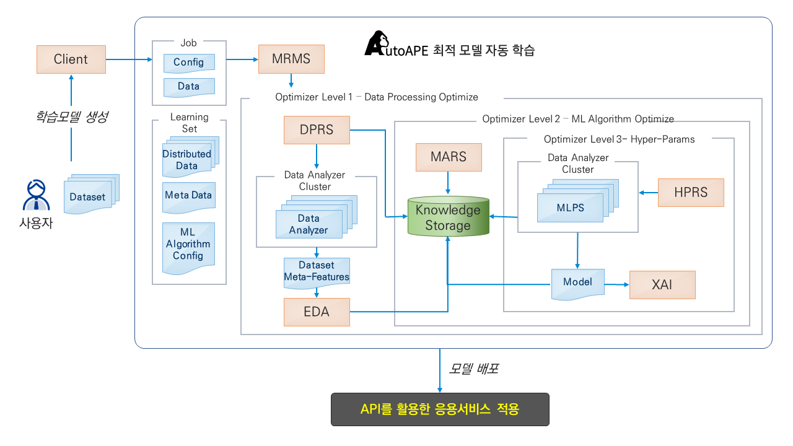

# AutoAPE User Guide
>AutoAPE 란 비전문가도 손쉽게 빅데이터를 분석 및 활용할 수 있도록 데이터의 특징과 분석 목적/ 의도에 근거하여 분석모델을 자동 수립할 수 있는 빅데이터 분석 모델 추천 자동화 기술이다.
공개소프트웨어 명칭인 AutoAPE는 AutoML과 XAI 기술을 활용하여 인간(Human)의 DNA와 가장 흡사한 유인원 같이 스스로 판단하여 가장 적절한
인공지능 모델을 추천하는 기술을 개발하겠다는 목표를 담았다.

### AutoAPE Architecture

- #### 위와 같이 AutoAPE 에서 사용자는 Dataset 관리, 학습모델 생성 등의 작업을 수행하여 최적 모델을 자동 학습시키는 것이 가능하다.

#### 먼저 작업 수행을 위해 로그인을 진행한다.
## Log in

- 본인의 계정으로 로그인 한다.
- AutoAPE 내에는 Dataset 과 Project 두가지 Tab 이 존재하며 아래는 각각의 Guide 문서이다.

    ### Guide

| Tab | Description |
| --- | ----------- |
| [**Dataset**](./Dataset.md) | Guide for Dataset Tab |
| [**Project**](./Project.md) | Guide for Project Tab |